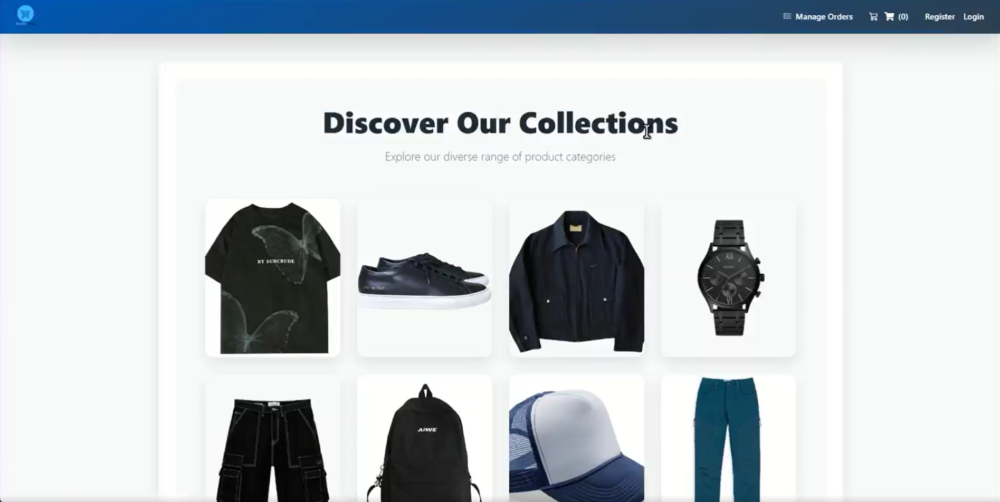
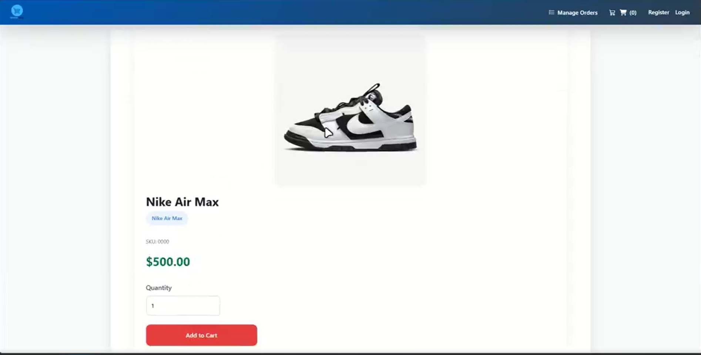
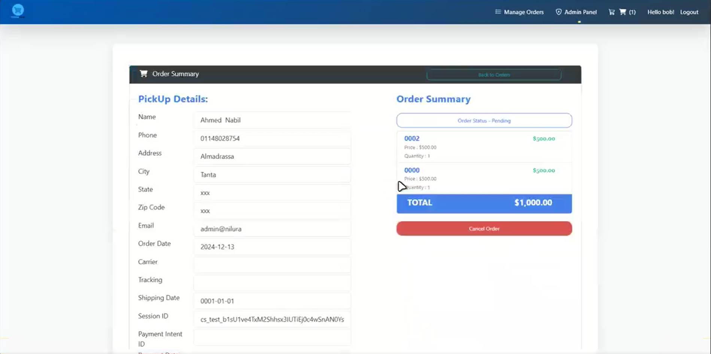
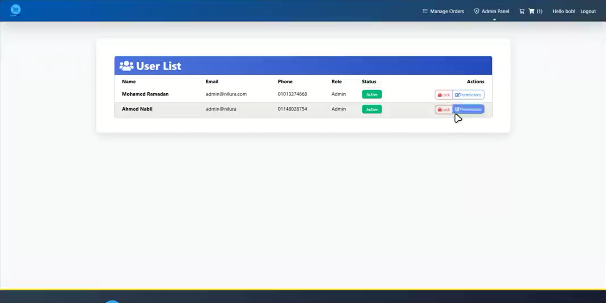

# Nilura - E-Commerce Platform


> A comprehensive fashion and apparel e-commerce platform built with ASP.NET MVC featuring a multi-layered architecture, robust user management, and secure payment processing.

## 📋 Table of Contents
- [Overview](#-overview)
- [Architecture](#-architecture)
- [Project Structure](#-project-structure)
- [Key Features](#-key-features)
- [Technologies Used](#-technologies-used)
- [Installation](#-installation)
- [Usage](#-usage)
- [Admin Dashboard](#-admin-dashboard)
- [Payment Integration](#-payment-integration)
- [Screenshots](#-screenshots)
- [Future Enhancements](#-future-enhancements)
- [Contributing](#-contributing)
- [Author](#-author)

## 📝 Overview

**Nilura** is a full-featured e-commerce platform specialized for fashion and apparel retail, developed as a graduation project using ASP.NET MVC. The platform delivers a complete online shopping experience from product discovery to checkout, with built-in order management and administrative capabilities.

The system implements industry best practices for web development, ensuring scalability, maintainability, and security throughout the application.

## 🏗️ Architecture

The application follows the **N-Tier Architecture** pattern with clearly separated concerns:

```
Nilura E-Commerce/
│
├── E-Commerce/                  # Presentation Layer (MVC)
│   ├── Areas/                   # Feature areas (Admin, Customer, Identity)
│   ├── Controllers/             # MVC controllers
│   ├── Views/                   # Razor views
│   ├── wwwroot/                 # Static files (CSS, JS, images)
│   └── Program.cs               # Application entry point
│
├── E-Commerce.DataAccess/       # Data Access Layer
│   ├── Data/                    # DbContext and database configuration
│   ├── Repository/              # Generic and specific repositories
│   ├── DbInitializer/           # Database seeding and initialization
│   └── Migrations/              # EF Core migrations
│
├── E-Commerce.Models/           # Business Models Layer
│   ├── Models/                  # Domain entities
│   ├── ViewModels/              # View-specific models
│   └── DTOs/                    # Data transfer objects
│
└── E-Commerce.Utility/          # Utility Layer
    ├── SD.cs                    # Static details and constants
    ├── EmailSender.cs           # Email service
    └── Helpers/                 # Helper classes and extensions
```

### Design Patterns Implemented

- **Repository Pattern**: Abstracts the data layer, making the application more testable
- **Unit of Work**: Maintains a list of objects affected by a business transaction
- **Dependency Injection**: Reduces coupling between classes
- **MVC Pattern**: Separates the application into Model, View, and Controller

## 📁 Project Structure

The solution is divided into four main projects:

1. **E-Commerce**: The main web application with MVC components
2. **E-Commerce.DataAccess**: Handles all database operations
3. **E-Commerce.Models**: Contains all business models and view models
4. **E-Commerce.Utility**: Houses constants, static details, and helper methods

## ✨ Key Features

### User Features

- **Product Catalog**
  - Browse products by categories
  - Filter by size, price, and other attributes
  - Detailed product pages with multiple images
  - Availability indicators

- **Shopping Experience**
  - Add to cart functionality
  - Wishlist management
  - Size selection for clothing items
  - Quick view product details

- **User Account Management**
  - Registration and login
  - Profile management
  - Address book
  - Order history and tracking

- **Checkout Process**
  - Guest checkout option
  - Multiple shipping methods
  - Order summary and confirmation
  - Secure payment processing

### Admin Features

- **Product Management**
  - Add, edit, and delete products
  - Manage product categories
  - Upload product images
  - Set pricing and inventory

- **Order Management**
  - View all orders
  - Update order status
  - Process refunds
  - Generate order reports

- **User Management**
  - Create and manage user roles
  - Assign permissions
  - View customer information
  - Manage staff accounts

- **Analytics Dashboard**
  - Sales statistics
  - Product performance
  - Customer insights
  - Revenue reports

## 🛠️ Technologies Used

### Backend
- **ASP.NET Core MVC**
- **Entity Framework Core**
- **C#**
- **SQL Server**
- **Identity Framework** for authentication and authorization

### Frontend
- **Razor Views**
- **Bootstrap**
- **JavaScript/jQuery**
- **AJAX**
- **HTML5/CSS3**

### Payment Processing
- **Stripe API Integration**

### Development Tools
- **Visual Studio**
- **Git** for version control
- **Azure** for deployment (optional)

## 📥 Installation

### Prerequisites
- Visual Studio 2019 or newer
- .NET 6.0 SDK or newer
- SQL Server (Local or Express)
- Stripe account (for payment processing)

### Setup Steps

1. **Clone the repository**
```bash
git clone https://github.com/ELZAYDA/E-Commerce.git
cd E-Commerce
```

2. **Update database connection string**
Edit the `appsettings.json` file in the `E-Commerce` project:
```json
"ConnectionStrings": {
  "DefaultConnection": "Server=(localdb)\\MSSQLLocalDB;Database=Nilura;Trusted_Connection=True;MultipleActiveResultSets=true"
}
```

3. **Apply migrations to create the database**
```bash
dotnet ef database update
```

4. **Configure Stripe API keys**
Update the `appsettings.json` file with your Stripe keys:
```json
"Stripe": {
  "PublishableKey": "your_publishable_key",
  "SecretKey": "your_secret_key"
}
```

5. **Build and run the application**
```bash
dotnet build
dotnet run --project E-Commerce
```

## 🚀 Usage

### Customer Journey

1. **Browse Products**
   - Navigate through categories using the menu
   - Use filters to narrow down product selection
   - View product details by clicking on items

2. **Shopping Cart**
   - Add items to cart
   - Adjust quantities
   - Select product variations (size, color)
   - Proceed to checkout

3. **Checkout Process**
   - Provide shipping information
   - Select shipping method
   - Enter payment details
   - Review and confirm order

4. **Order Tracking**
   - Access order history from account dashboard
   - View order status and tracking information
   - Download invoices

## 👑 Admin Dashboard

The admin area provides comprehensive management capabilities:

1. **Access the Admin Panel**
   - Navigate to `/Admin` after logging in with admin credentials

2. **Manage Inventory**
   - Add new products
   - Update existing product information
   - Manage stock levels

3. **Process Orders**
   - View incoming orders
   - Update order status
   - Generate shipping labels

4. **User Management**
   - Create new user accounts
   - Assign roles (Admin, Employee, Customer)
   - Reset passwords

## 💳 Payment Integration

Nilura integrates with Stripe for secure payment processing:

- **One-time Payments**: Process standard checkouts
- **Saved Payment Methods**: Allow customers to save cards for future purchases
- **Refund Processing**: Handle returns and refunds through the admin panel

## 📸 Screenshots

### Home Page


### Product Catalog


### Shopping Cart


### Admin Dashboard


## 🚀 Future Enhancements

- **Mobile Application**: Native mobile apps for iOS and Android
- **AI-Powered Recommendations**: Personalized product suggestions
- **Advanced Analytics**: Deeper insights into customer behavior
- **Multi-language Support**: Internationalization for global markets
- **Subscription Models**: Implementation of recurring payment options

## 🤝 Contributing

Contributions are welcome! Please feel free to submit a Pull Request.

1. Fork the repository
2. Create your feature branch (`git checkout -b feature/amazing-feature`)
3. Commit your changes (`git commit -m 'Add amazing feature'`)
4. Push to the branch (`git push origin feature/amazing-feature`)
5. Open a Pull Request

## 👨‍💻 Author

**Ahmed Nabil** - Full Stack Developer


📧 Email: ahmedelzayda19@gmail.com
🔗 Project: github.com/ELZAYDA/E-Commerce
- LinkedIn: [Ahmed Nabil](https://linkedin.com/in/ahmed-nabil)


<p align="center">
  Made with ❤️ by Ahmed Nabil
</p>
